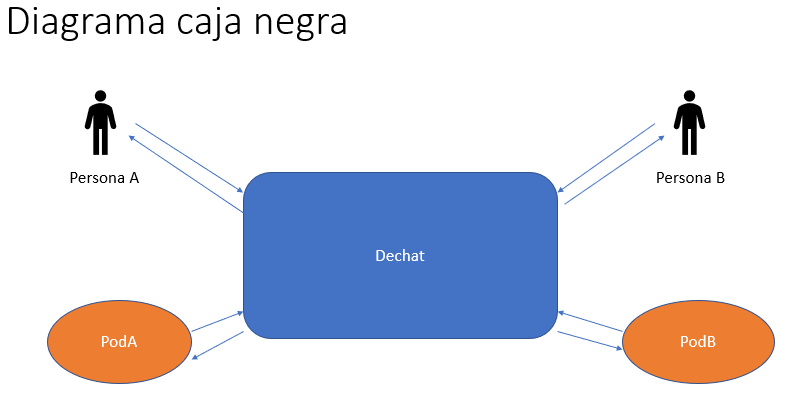
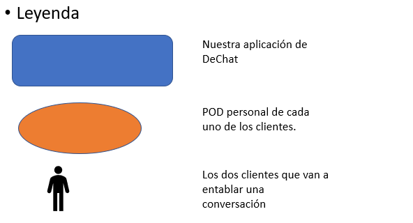

[[section-system-scope-and-context]]
== Alcance y Contexto del Sistema

****
[options="header"]
|==================================================
|Socios de comunicacion | Entendimiento
|Clientes | Interactuan de forma normal con la aplicacion de DeChat, conversando con otras personas, mandando imagenes etc.
|DeChat | Una vez que el cliente envia un mensaje, imagen o similar, se iniciara una "comunicación" con el POD personal de ese cliente, siempre y cuando se haya concedido permiso a DeChat para acceder al POD, mediante la libreria "solid-auth-client", para guardar en ese POD el mensaje y posteriormente enviar un enlace al otro cliente, con el que se esta manteniendo una conversación, de ese mensaje que acaba de enviar concediendole permiso para ver SOLO ese mensaje. Pero siempre manteniendo ese mensaje en el POD personal del primer cliente, esto es lo que se consigue con descentralización.
Sería también factible que alguno de los clientes tuviese varios POD y distribuyera los datos entre ellos en cualquier caso el funcionamiento seguiría siendo el mismo, solamente aumenta la descentralización.
|POD | Son almacenes de datos personales en linea y va a estar alojado donde el usuario lo estime oportuno.
Aqui es donde van a estar almacenados toda la informacion, mensajes, etc. Que haya comunicado el cliente con la aplicacion de DeChat. Su función principal será separar la aplicación y los datos.
|==================================================

.Motivación
Las interfases de dominio y las interfases técnicas a los socios de comunicación son de los aspectos más críticos del sistema.
Se debe asegurar el entendimiento de ellos.

.Forma

* Listas de socios de comunicación y sus interfases.
****

=== Contexto de Negocio

****

En este diagrama de caja negra se muestra las interfases de dominio a los socios y como se va a realizar la comunicación entre las distintas entitades que van a formar la estructura basica de nuestra aplicacion de DeChat. No se explicará su funcionamiento interno, para ello se realizaran otros diagramas en siguientes apartados como el "Diagrama de caja blanca".

Tambien se ha proporcionado una pequeña leyenda de este diagrama para facilitar su compresion en caso de que haya habido alguna duda.

Todas las partes interesadas deben entender que datos son intercambiados con el ambiente del sistema.

He utilizado un diagrama de caja negra.
****

=== Contexto Técnico

****

****

