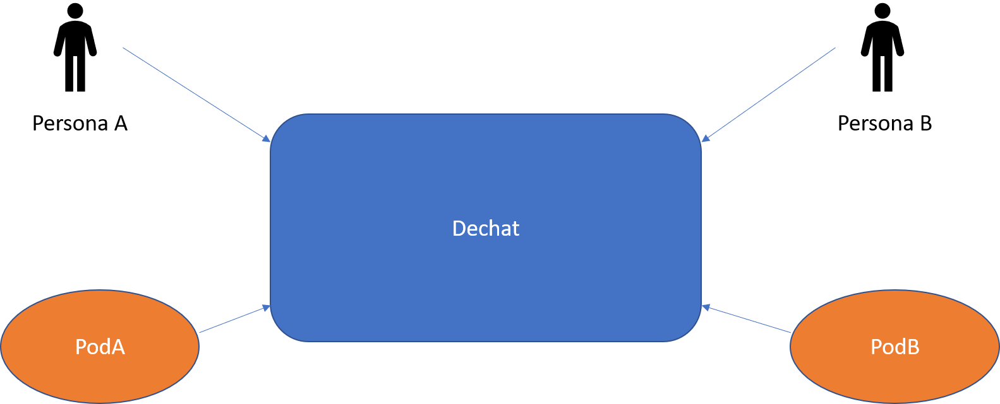

[[section-building-block-view]]

== Vista de Bloques

[role="arc42help"]
****
.Contenido
La vista de bloques muestra la descomposición estática del sistema en bloques de construcción (módulos, componentes,
subsistemas, clases, interfases, paquetes, bibliotecas, marcos de desarrollo, capas, particiones, funciones, macros,
operaciones, estructuras de datos,...) así como sus dependencias (relaciones, asociaciones,...)

Esta vista es obligatoria para cualquier documentación de arquitectura.
Es la analogía al plano de una casa.

.Motivación
Mantener una visión general de su código fuente haciendo su estructura comprensible de manera abstracta.

Esto permite comunicar a las partes interesades en un nivel abstracto sin entrar en detalles de implementación.

.Forma
La vista de bloques comprende una colección jerárquica de cajas negras y cajas blancas (ver figura de abajo)
y sus descripciones.

image:05_building_blocks-ES.png["Jerarquía de bloques de construcción"]

*Nivel 1* comprende la descripción de Caja Blanca del sistema en general junto con las descripciones de Caja Negra de
todos los bloques contenidos.

*Nivel 2* hace zoom a los bloques de construcción del Nivel 1. Entonces contiene la descripción de Caja Blanca de los
bloques de construcción selecionadas del nivel 1,junto con las descripciones de caja negra de sus bloques de construcción
internas.

*Nivel 3* Hace zoom a los bloques selectos del nivel 2, y así sucesivamente.
****

=== Sistema General de Caja Blanca

Motivación::
Este diagrama representa la vista más global del proyecto

Bloques de construcción contenidos::
[cols="1,2" options="header"]
|===
| **Nombre** | **Responsabilidad**
| Persona | Usuario usando el chat
| POD | Desc. en el glosario.
| Dechat | Aplicación (chat)
|===

=== Nivel 2

[role="arc42help"]
****
Aquí se especifica la estructura interna de (algunos) bloques de construcción del nivel 1 como cajas blancas.

Debe decidir cuales bloques de construcción del sistema son lo suficientemente importantes para justificar una
descripción detallada. Prefiera la relevancia sobre la completitud. Especifique bloques de construcción importantes,
sorprendentes, riesgosos, complejos o volátiles. Deje fuera las partes normales, simples, estándares o aburridas del sistema.
****

==== Caja Blanca _<bloque de construcción 1>_

[role="arc42help"]
****
...Describe la estructura interna de _bloque de construcción 1_.
****

_<plantilla de caja blanca>_

==== Caja Blanca _<bloque de construcción 2>_

_<plantilla de caja blanca>_

...

==== Caja Blanca _<bloque de construcción m>_

_<plantilla de caja blanca>_

=== Nivel 3

[role="arc42help"]
****
Aqui se especifica la estructura interna de (algunos) de los bloques de construcción del nivel 2 como cajas blancas.

Cuando la arquitectura requiera más niveles detallados copiar esta sección para niveles adicionales.
****

==== Caja Blanca <_bloque de construcción x.1_>

[role="arc42help"]
****
Especifica la estructura interna de _bloque de construcción x.1_.
****

_<plantilla de caja blanca>_

==== Caja Blanca <_bloque de construcción x.2_>

_<plantilla de caja blanca>_

==== Caja Blanca <_bloque de construcción y.1_>

_<plantilla de caja blanca>_
